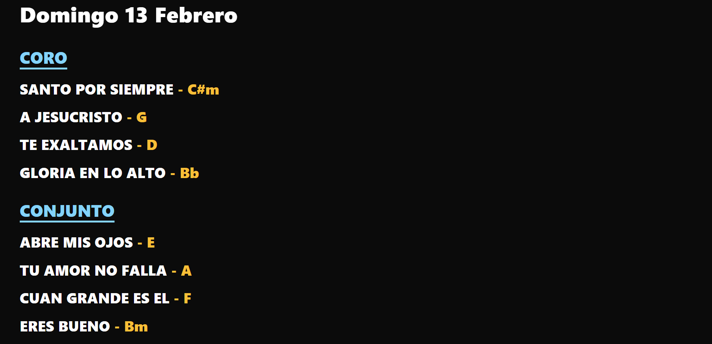

# 🎵 FreeShow Live Song Ticker Bridge


---

# 🖼 Visual Preview

## 🎬 Ticker (1 línea)


## 🎬 Ticker (2 líneas)


## 🖥 Vista Vertical



---

# 🇪🇸 Versión en Español

## 🎯 Descripción

**FreeShow Live Song Ticker Bridge** es un servidor intermedio (middleware) que permite mostrar dinámicamente las canciones del proyecto activo en FreeShow dentro de una diapositiva tipo **Web / Browser**.

Diseñado para:

- Pantalla de escenario (músicos)
- Seguimiento del orden del culto
- Entornos 1080p
- Integraciones técnicas avanzadas

---

# 🧠 Arquitectura

```
             ┌───────────────────┐
             │      FreeShow     │
             │ (WebSocket 5505)  │
             └─────────┬─────────┘
                       │
                WebSocket Client
                       │
             ┌─────────▼─────────┐
             │   Node.js Bridge  │
             │  (Express Server) │
             ├───────────────────┤
             │ - get_projects    │
             │ - Scan .show      │
             │ - Render HTML     │
             └─────────┬─────────┘
                       │
                HTTP (localhost:3000)
                       │
             ┌─────────▼─────────┐
             │   Web Slide Item  │
             │   dentro FreeShow │
             └───────────────────┘
```

---

# ⚙️ Funcionamiento Técnico

## 1️⃣ WebSocket

Conexión a:

```
ws://localhost:5505
```

Acción utilizada:

```
get_projects
```

Detecta automáticamente el proyecto más recientemente usado.

---

## 2️⃣ Indexación de Canciones

Escanea:

```
Documents/FreeShow/Shows
```

Formato esperado:

```json
["showId", { "name": "Nombre Canción" }]
```

Construye un mapa interno:

```
showId → showName
```

---

## 3️⃣ API Interna

Endpoint dinámico:

```
/api/ticker
```

Actualización automática:

```js
setInterval(refresh, 2000)
```

No requiere recargar la diapositiva.

---

# 🌐 URLs Disponibles

### 1️⃣ Vista Vertical (con título)

```
/songs
```

---

### 2️⃣ Ticker SOLO CORO

```
/songs/ticker/coro
```

Formato:

```
CORO: ALABANZA 1 • ALABANZA 2
```

---

### 3️⃣ Ticker SOLO CONJUNTO

```
/songs/ticker/conjunto
```

---

### 4️⃣ Ticker Ambos (1 Línea)

```
/songs/ticker
```

---

### 5️⃣ Ticker Ambos (2 Líneas)

```
/songs/ticker2
```

---

# 🎛 Personalización de Secciones (MUY IMPORTANTE)

Por defecto el sistema detecta las secciones:

```
Coro
Conjunto
```

Estas pueden modificarse fácilmente en el archivo:

```
server.js
```

Busca la función:

```js
function buildSongsBySection(project) {
```

Dentro encontrarás este bloque:

```js
if (isSection(item)) {
  const key = String(item.name || "").trim().toLowerCase();

  // 👇 MODIFICAR AQUÍ LAS SECCIONES PERMITIDAS
  current = (key === "coro" || key === "conjunto") ? key : null;
  continue;
}
```

---

## 🔧 Ejemplo: agregar sección "Especial"

```js
current = (
  key === "coro" ||
  key === "conjunto" ||
  key === "especial"
) ? key : null;
```

---

## 🔧 Ejemplo: cambiar "Conjunto" por "Banda"

```js
current = (
  key === "coro" ||
  key === "banda"
) ? key : null;
```

⚠️ Importante:  
El nombre debe coincidir exactamente con el nombre de la sección en FreeShow.

---

# 🎨 Diseño Visual

- Títulos en MAYÚSCULAS
- Acordes respetan formato original
- Acordes en amarillo
- Encabezados azules subrayados
- Scroll infinito
- Optimizado para 1080p

---

# 🚀 Instalación

```bash
git clone https://github.com/usuario/repo.git
cd repo
npm install
node server.js
```

---

# 🪟 Ejecutar como Servicio en Windows

```bash
npm install -g pm2
pm2 start server.js --name freeshow-bridge
pm2 save
pm2 startup
```

---

# 🔧 Variables de Entorno

| Variable | Descripción |
|----------|------------|
| FREESHOW_SOCKET | URL WebSocket |
| FREESHOW_DATA_DIR | Carpeta FreeShow |
| PORT | Puerto del servidor |

---

# 🗺 Roadmap

- [ ] Velocidad adaptativa automática
- [ ] Parámetros configurables vía URL
- [ ] Selección manual de proyecto
- [ ] Panel web de administración
- [ ] Docker oficial
- [ ] Multi-pantalla simultánea
- [ ] API pública opcional

---

# 📜 Licencia

MIT License  
Uso libre para iglesias y ministerios.

---

---

# 🇺🇸 English Version

## 🎯 Overview

FreeShow Live Song Ticker Bridge is a middleware server that dynamically displays the active FreeShow project songs inside a Web/Browser slide item.

Designed for:

- Stage displays
- Musicians monitoring
- 1080p environments
- Technical integrations

---

# 🧠 Architecture

```
FreeShow (WebSocket 5505)
        ↓
Node.js Bridge (Express)
        ↓
HTML Slide inside FreeShow
```

---

# ⚙️ Technical Flow

1. Connects to WebSocket  
2. Calls `get_projects`  
3. Detects active project  
4. Scans `.show` files  
5. Builds dynamic HTML  
6. Updates every 2 seconds  

---

# 🎛 Custom Sections

Inside `server.js` locate:

```js
function buildSongsBySection(project)
```

Modify this line:

```js
current = (key === "coro" || key === "conjunto") ? key : null;
```

Add or change section names as needed.

Example:

```js
current = (
  key === "coro" ||
  key === "band"
) ? key : null;
```

Section names must match exactly those defined in FreeShow.

---

# 🌐 Available URLs

```
/songs
/songs/ticker/coro
/songs/ticker/conjunto
/songs/ticker
/songs/ticker2
```

---

# 🖼 Adding Mockups

Create a folder:

```
/docs
```

Add:

```
mockup-ticker.gif
mockup-ticker2.gif
mockup-vertical.png
```

GitHub will automatically render them in this README.

---

# 📜 License

MIT License  
Free for church and ministry use.
